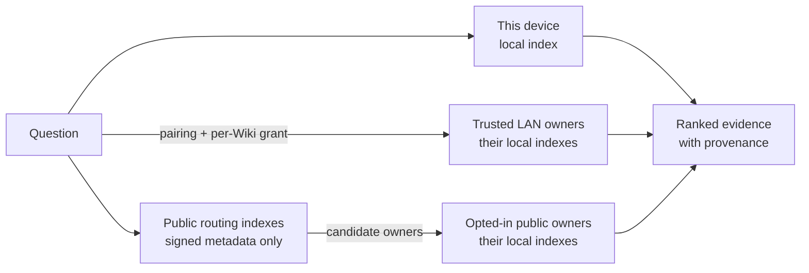
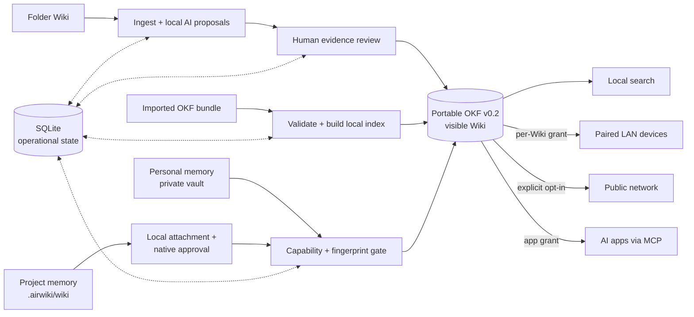

# AirWiki

<p align="center">
  
</p>

<p align="center">
  <strong>Your private, portable wiki—built from the knowledge you already have.</strong>
</p>

<p align="center">
  macOS 13+ · Windows 10/11 · OKF v0.2 · Apache-2.0
</p>

<p align="center">
  <a href="#how-it-works">How it works</a> ·
  <a href="#availability">Availability</a> ·
  <a href="https://github.com/airwiki/airwiki/releases/latest">Downloads</a> ·
  <a href="#run-from-source">Run from source</a> ·
  <a href="CONTRIBUTING.md">Contribute</a>
</p>

AirWiki is an open-source desktop app that turns folders, [Open Knowledge Format (OKF)](https://github.com/GoogleCloudPlatform/knowledge-catalog/blob/main/okf/SPEC.md) bundles, and assistant conversations into wikis you can search, review, and selectively share. It keeps knowledge on your device by default and uses local AI to help organize it without taking control away from you.

> [!IMPORTANT]
> AirWiki is in active development and does not have a supported public download yet. Current builds are development or internal release candidates. See [Availability](#availability) before installing or testing one.

<p align="center">
  <a href="docs/assets/airwiki-demo.mp4">
    
  </a>
  <br>
  <sub>10-second product tour · <a href="docs/assets/airwiki-demo.mp4">MP4 version</a> · synthetic data only</sub>
</p>

## Why AirWiki

### Keep knowledge portable

A Wiki is an OKF v0.2 bundle: human-readable Markdown and YAML that is not locked inside a proprietary cloud database. Folder-based Wikis leave the original documents untouched, while imported and assistant-managed Wikis remain portable bundles.

### Let AI assist, not decide

Local models can extract, enrich, index, and propose knowledge. AirWiki keeps every folder-derived proposal tied to its source revision and requires a person to compare the evidence before publication.

### Share only what you choose

Local use, paired-device access, external AI access, and experimental public discovery are separate permissions. Connecting a client or another device never silently publishes a Wiki or grants access to it.

### Give your agents simple, open memory without vendor lock-in

Codex, ChatGPT, Claude Code, Gemini CLI, and generic MCP clients use the same AirWiki memory workflow through MCP. Conversations without a project can use the private personal vault. A code or study folder can instead carry one reviewable `.airwiki` OKF v0.2 Wiki: collaborators who clone or copy it keep the same project knowledge while every local application and clone still needs its own approval. AirWiki never stages, commits, merges, pulls, or pushes Git.

## How it works

1. **Create a Wiki.** Start from a folder, import an OKF v0.2 folder or ZIP, create private personal memory, or explicitly initialize portable project memory in `.airwiki`.
2. **Build trusted knowledge.** AirWiki indexes locally. For source folders, local AI prepares proposals and shows the exact evidence behind them.
3. **Search and share deliberately.** The Library groups matches from your device, paired devices, and—only when selected for that search—public Wikis. Enable access independently for each Wiki and destination.

Folder Wikis can watch for new files or update manually. Imported OKF Wikis have no source watcher. Personal and project memory can be edited only by applications you explicitly authorize. A missing, invalid, conflicted, or identity-changed project bundle is withheld from agents and every network until its files are valid again.

## How distributed search works

AirWiki sends a question to the places that still own the knowledge instead of
copying every Wiki into one central service.



Each owner runs lexical and semantic retrieval locally, checks whether the
passage answers the question, and revalidates the current publication and
permission before returning bounded evidence. AirWiki then combines the
independent rankings while keeping local, nearby, and public origins visible.
An unavailable device or public route produces explicit partial coverage
instead of silently turning an incomplete search into a complete one.

LAN discovery does not grant access: devices must pair and the owner grants
each Wiki separately. Public discovery uses replaceable indexes that know how
to find opted-in owners but never receive their documents, snippets,
embeddings, or operational indexes. Opening an authorized LAN or public result
loads the complete published OKF Wiki directly from its owner in a read-only
workspace. Read the [conceptual search and federation guide](docs/search-and-federation.md)
for the complete journey and privacy boundaries.

## See the flow

| Review before publication | Search across authorized sources |
| --- | --- |
| [](docs/assets/airwiki-review-flow.png) | [](docs/assets/airwiki-search-sources.png) |
| Source-bound evidence stays beside the proposal and final decision. | Local, nearby, and public results remain visibly distinct in one search experience. |

## Who it is for

- People and researchers who already keep useful knowledge in local files.
- Communities and small teams that need selective sharing without centralizing every document.
- Developers and knowledge workers who want portable memory across multiple AI assistants.
- Organizations evaluating local-first knowledge workflows with explicit trust boundaries.

## What works today

- Create continuously updated or manual Wikis from Markdown and text-based PDF folders.
- Import hierarchical OKF v0.2 folders and ZIP bundles while preserving unknown types and fields.
- Browse published concepts as a file-like tree or an on-demand relationship graph.
- Review local-AI proposals against revision-bound source evidence before publishing.
- Search with local lexical and vector retrieval, including provenance and assurance state.
- Use one Library for the local inventory and grouped local, nearby and explicitly
  opted-in public search results; Settings keeps General, Connections and AI
  apps in focused sections with accessible status.
- Pair devices on a private LAN and grant access per Wiki.
- Open an authorized LAN or public result in the same read-only, file-oriented
  Wiki workspace used for local knowledge.
- Opt selected, reviewed Wikis into experimental public search and browse.
- Connect ChatGPT/Codex, Claude, Gemini, and generic MCP clients without storing provider API keys.
- Create isolated assistant-memory Wikis with fingerprint-based updates and revocable capabilities.
- Initialize a portable `.airwiki` project Wiki, approve each local clone once,
  search it automatically from supported agents, and review its changes as
  ordinary files without AirWiki invoking Git.
- Inspect trust, freshness, lifecycle, provenance, compatibility, and health for OKF v0.2 concepts.
- Run explicitly confirmed `airwiki-wasm` attested computations in a constrained, no-WASI sandbox.

## Privacy by default

- New Wikis are local-only.
- Original folder contents remain on the source device and are never deleted by AirWiki.
- Publication, peer sharing, public discovery, and external AI access require independent human decisions.
- Changed source knowledge is withdrawn until its new revision is reviewed.
- The local model cannot publish, grant access, or decide whether content may leave the device.
- Search results use bounded summaries. Opening an authorized LAN or public
  result loads the complete published OKF Wiki automatically: its hierarchy,
  `index.md`, `log.md`, stable concept pages, metadata, and relationship graph.
  Internal frames remain bounded, but there is no user-visible pagination or
  silent truncation. Original source files, source paths, chunks, embeddings,
  and operational search indexes never leave the owner's device.
- Default logs omit documents, queries, snippets, credentials, local paths, and network identities.

Read the [threat model](docs/threat-model.md) for the complete trust boundaries and failure behavior.

## Availability

| Platform | Current development target |
| --- | --- |
| macOS | Apple silicon, macOS 13 or later |
| Windows | Windows 10/11 x64 with AVX2 |
| Linux, web, mobile | Not currently supported |

There are no supported public release artifacts yet. Once the first release passes the complete acceptance checklist, current signed installers will be available from [GitHub Releases](https://github.com/airwiki/airwiki/releases/latest). Until then, use only development candidates obtained through an agreed private channel, verify their SHA-256 independently, and do not bypass Gatekeeper, SmartScreen, model hashes, or runtime verification.

For current candidate requirements and first-run behavior, read [Installing and running AirWiki](docs/install.md).

## Run from source

You need the native build tools for your platform, the Rust toolchain pinned in [`rust-toolchain.toml`](rust-toolchain.toml), Node.js 24.15.0, Corepack, and the [Tauri v2 prerequisites](https://v2.tauri.app/start/prerequisites/).

```bash
cd apps/desktop/ui
corepack pnpm install --frozen-lockfile --ignore-scripts --prod=false
cd ..
./ui/node_modules/.bin/tauri dev
```

The first-run flow explains local privacy, offers a direct path to the first folder Wiki, and shows the recommended local model without forcing optional network, background, or integration decisions. Initial model preparation needs disk space and network access; curation and local search work offline after the required assets are verified.

This repository welcomes contributors interested in Rust, local AI, privacy-preserving search, knowledge management, and accessible desktop UX. Start with [CONTRIBUTING.md](CONTRIBUTING.md) and the [open issues](https://github.com/airwiki/airwiki/issues).

Before the public release, feedback is especially valuable around first-run clarity, evidence review, permission boundaries, cross-device search, and assistant memory. Please use [GitHub Issues](https://github.com/airwiki/airwiki/issues) for reproducible problems and focused product feedback.

## Architecture at a glance

AirWiki is a Rust workspace with a Tauri v2 desktop shell and Svelte UI. SQLite owns operational state and local paths; published OKF files are the source of truth for each visible Wiki. Domain rules stay outside the UI and transport layers.



Original folder documents remain outside the published bundle. Every path beyond local use crosses an explicit, independently managed access boundary.

<details>
<summary>Repository map</summary>

- `crates/`: contracts, domain logic, inference, networking, and MCP behavior.
- `apps/`: the Tauri desktop application and narrowly scoped helper executables.
- `packaging/`: development packaging and platform manifests.
- `xtask/`: reproducible documentation, licensing, evaluation, and repository checks.
- `docs/`: architecture, decisions, security, operations, and release guidance.
- `fixtures/`: synthetic test material only.

</details>

See the [architecture overview](docs/architecture.md) and [architecture decisions](docs/adr/README.md) for details.

## Documentation

### Use and evaluate AirWiki

- [Installation and local operation](docs/install.md)
- [Search across local, LAN, and public Wikis](docs/search-and-federation.md)
- [Local chat integrations and assisted memory](docs/chat-integrations.md)
- [AirWiki's OKF v0.2 profile](docs/okf-v02-profile.md)
- [Two-node acceptance runbook](docs/two-node-runbook.md)
- [Recovery](docs/recovery.md)

### Build and contribute

- [Contributing](CONTRIBUTING.md)
- [Architecture](docs/architecture.md)
- [Threat model](docs/threat-model.md)
- [Code review](CODE_REVIEW.md)
- [Development packaging](docs/packaging.md)
- [Public release process](docs/release-process.md)
- [Code signing policy](docs/code-signing-policy.md)
- [Security policy](SECURITY.md)
- [Changelog](CHANGELOG.md)

## Deliberate limits

AirWiki does not currently provide OCR, DOCX ingestion, image/audio/video processing, cloud sync, accounts, SSO, source-document replication, arbitrary remote editing, automatic Git operations or conflict resolution, arbitrary script runtimes, a system daemon, silent updates, or web/mobile access. MCP mutation is limited to explicitly authorized personal or project memory Wikis. Public federation remains experimental and has no supported always-on public relay service.

## License

AirWiki is open source under the [Apache License 2.0](LICENSE). Windows code signing for development candidates is provided by [SignPath.io](https://about.signpath.io), with a certificate from the [SignPath Foundation](https://signpath.org), under the project's [code signing policy](docs/code-signing-policy.md).

ChatGPT, Codex, Claude and Gemini names and marks belong to OpenAI, Anthropic and Google
respectively. AirWiki uses their official artwork only to identify optional integrations; this
does not imply sponsorship or endorsement. See [third-party notices](THIRD_PARTY_NOTICES.md).
