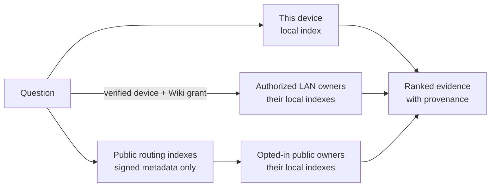
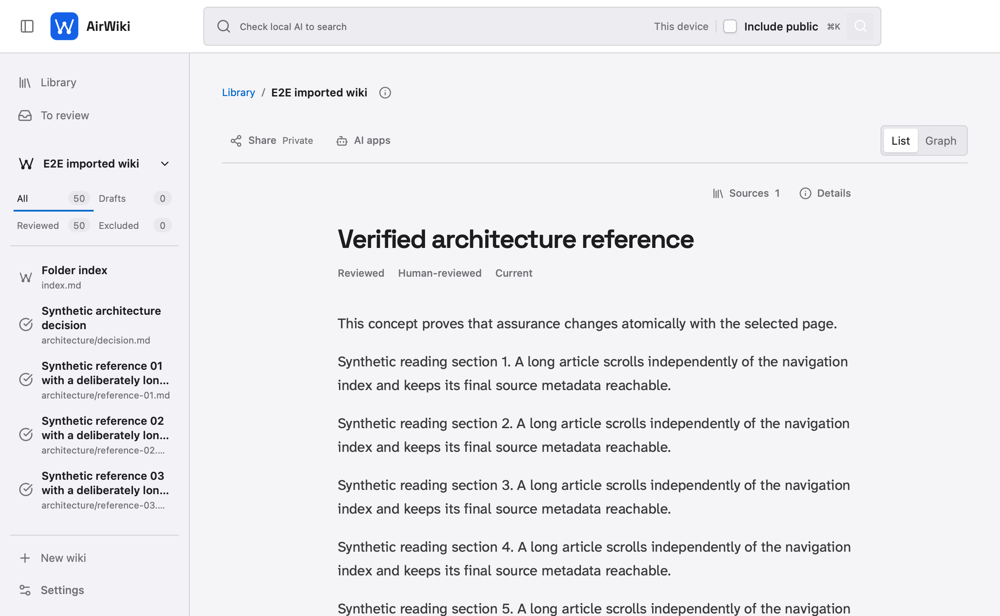
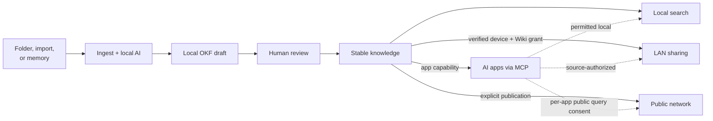

# AirWiki

<p align="center">
  
</p>

<p align="center">
  <strong>Turn your docs into knowledge people and AI can use.</strong>
</p>

<p align="center">
  macOS 13+ (Apple silicon) · Windows 10/11 x64 (AVX2) · OKF v0.2 · Apache-2.0
</p>

<p align="center">
  <a href="https://airwiki.github.io/airwiki/">Website</a> ·
  <a href="#put-your-knowledge-to-work">Use cases</a> ·
  <a href="#how-airwiki-works">How it works</a> ·
  <a href="#availability">Availability</a> ·
  <a href="https://github.com/airwiki/airwiki/releases">Technical beta</a> ·
  <a href="FAQ.md">Beta FAQ</a> ·
  <a href="#run-from-source">Run from source</a> ·
  <a href="CONTRIBUTING.md">Contribute</a> ·
  <a href="SUPPORT.md">Feedback</a> ·
  <a href="docs/code-signing-policy.md">Code signing policy</a>
</p>

AirWiki is an open-source desktop app for turning team documentation, study notes, and project decisions into searchable wikis. Help colleagues find another department's knowledge, let classmates learn from notes you choose to publish, or give a coding assistant the context behind your repository. Start from folders, [Open Knowledge Format (OKF)](https://github.com/GoogleCloudPlatform/knowledge-catalog/blob/main/okf/SPEC.md) bundles, or authorized assistant memory. Your knowledge is private by default; you choose who can use it.

> [!IMPORTANT]
> AirWiki is in active development and has no supported stable download yet. Pre-releases are manual test candidates, are never selected by the updater, and may be blocked by platform policy. Signing status is stated per platform in each release. Read [Availability](#availability) before installing one.

<p align="center">
  <a href="docs/assets/airwiki-demo.mp4">
    
  </a>
  <br>
  <sub>10-second product tour · <a href="docs/assets/airwiki-demo.mp4">MP4 version</a> · synthetic data only</sub>
</p>

## Put your knowledge to work

These are example workflows to evaluate with synthetic material in the technical
beta, not customer deployments or claims of production readiness.

### Teams: find answers across departments

A support colleague needs to understand how engineering handles a failed import.
Engineering turns its troubleshooting notes into a reviewed Wiki and grants
access to verified colleagues' devices on the local network. Support can search
that knowledge and open the published explanation without asking someone to
resend the same document. Connected assistants can retrieve the evidence when
the source owner has authorized that AI access.

**The value:** make each team's expertise useful across the company while each
owner controls which wikis are shared. Private sharing currently uses authorized
LAN devices; AirWiki does not provide SSO, cloud sync, or a managed private
network for distributed offices. [How private sharing works](docs/search-and-federation.md#search-on-a-private-lan).

### Students: let a useful explanation reach the next class

A student turns their own notes on database normalization into a Wiki, reviews
the concepts, and chooses to publish it to the experimental public network.
Classmates, or students taking the same subject elsewhere, can search for that
topic and read the published Wiki with its sources. An AI study assistant can
search it too when public search is enabled for that app.

**The value:** build on explanations other students have already worked through.
Publish only material you have the right to share. Public content can be retained
by readers; discovery depends on a reachable publisher and configured public
indexes, with no supported always-on relay service today.
[How public discovery works](docs/search-and-federation.md#search-on-the-public-network).

### Developers: carry project context into the next AI session

A repository's README explains setup, but the reason for a design choice is buried
in an old conversation. Initialize a portable `.airwiki` project Wiki and authorize
your coding assistant to capture confirmed decisions, conventions, and reusable
procedures. Codex, Claude Code, or Gemini CLI can consult that memory in later
tasks, and you can review its files alongside your code.

**The value:** keep project knowledge available across sessions and compatible
tools, so you spend less effort rebuilding context. You control what enters Git;
AirWiki never commits or pushes, and a new clone needs local approval before an
assistant can use its memory. [Connect an assistant and project memory](docs/chat-integrations.md#assisted-memory-guide).

## What makes the knowledge useful to AI?

AirWiki gives compatible assistants a way to **retrieve relevant knowledge on
demand** through MCP, the connection protocol used by AI tools. Wikis use readable
OKF concept pages, relationships, and provenance; local lexical and vector search
finds relevant evidence and returns bounded passages with source references.
An assistant can consult the project's decisions or a permitted team Wiki as it
works, instead of relying on you to paste the same background into every chat.

This is structured, retrievable context, not model training or a measured promise
of lower token costs or better answers. AirWiki's preparation and retrieval run
locally; a connected cloud AI provider may process the evidence its app receives.
See the [AI-access boundaries](docs/chat-integrations.md) before connecting one.

## How AirWiki works

1. **Create a Wiki.** Start from a folder, import an OKF v0.2 folder or ZIP, create private personal memory, or explicitly initialize portable project memory in `.airwiki`.
2. **Review progressively.** Folder sources appear immediately as local, unverified OKF `draft` concepts. Approve a draft to make it stable and searchable, leave it for later, or exclude it without deleting its evidence. **Update from folder** detects new or changed files and reanalyzes current drafts without rewriting reviewed or excluded knowledge.
3. **Search accessible knowledge.** One Library groups results from this device, authorized nearby devices, and—only when selected—public wikis. Origins and partial coverage remain visible.
4. **Share deliberately.** LAN and Internet exposure are independent, opt-in choices for your own stable wikis.
5. **Connect AI apps separately.** ChatGPT, Claude, Codex, Gemini, and generic MCP clients can search permitted local and authorized LAN knowledge. Public search is a separate, per-app preference because it may send that app's query outside the device.

Folder wikis can watch their source or update manually. Imported OKF wikis have no source watcher. Personal and project memory can be edited only by applications you explicitly authorize. AirWiki never stages, commits, merges, pulls, or pushes Git.

## Sharing and AI access are different

AirWiki keeps the two decisions separate so that “connect my assistant” never means “publish my wiki.”

| Decision | What it controls | Default |
| --- | --- | --- |
| **Share** | Which of your stable wikis may leave this device through a verified LAN grant or public publication | Off |
| **Connect an AI app** | Which compatible local wikis the app may read, plus knowledge already authorized by nearby owners | Explicit connection; local read is granted by default and remains revocable per wiki |
| **Search public knowledge** | Whether that exact app may send queries to configured public indexes and publishers | Off |

Enabling public search for an AI app does **not** publish any of your wikis. A remote owner still decides what it exposes, and AirWiki revalidates authorization before returning evidence.

## Search without centralizing knowledge

AirWiki sends a question to the places that still own the knowledge instead of copying every wiki into a central service.



Each owner runs retrieval locally and checks current exposure before returning bounded evidence. AirWiki combines the independent rankings while keeping local, nearby, and public origins visible. If one source is unavailable, successful branches still return results with an explicit coverage gap.

LAN discovery alone grants nothing: devices must be verified and the owner must grant the wiki. Public routing indexes locate opted-in publishers but do not receive their documents, snippets, embeddings, or operational indexes. Opening an authorized remote result loads its published OKF wiki in a read-only workspace.

The Library decides public search per query. Each connected AI app has its own disabled-by-default **Search public knowledge** preference. Read the [search and federation guide](docs/search-and-federation.md) for the complete journey and privacy boundaries.

## See the flow

| Read with your Wiki in reach | Review a draft with its evidence |
| --- | --- |
| [](docs/assets/airwiki-reader.png) | [](docs/assets/airwiki-review-flow.png) |
| The index scrolls independently; reading mode can hide it. | Approve, leave for later or exclude without losing the end of the editor. |

The screenshots and ten-second tour show the 0.3 desktop redesign with synthetic
fixtures. They demonstrate the interface, not model quality or a completed
publication decision. [Read the 0.3 candidate notes](docs/releases/0.3.0.md).

## What works today

- **Build knowledge:** create manual or watched wikis from Markdown and text-based PDFs; import hierarchical OKF v0.2 folders and ZIPs; browse draft, reviewed, and excluded concepts.
- **Read comfortably:** navigate a contextual Wiki index, hide or resize the sidebar, and reopen the last valid local article across sessions.
- **Review safely:** compare a proposal with revision-bound source evidence, approve at your pace, and withdraw changed source knowledge until its replacement is reviewed.
- **Find it:** combine lexical and vector search across local, authorized LAN, and explicitly selected public sources with provenance, assurance, and partial-coverage state.
- **Share it:** verify nearby devices and grant individual wikis; independently opt reviewed wikis into experimental public discovery.
- **Use it with assistants:** connect ChatGPT/Codex, Claude, Gemini, or generic MCP clients without provider API keys; keep local wiki exceptions and public-query consent per app.
- **Inspect it:** view the wiki's knowledge state, Local/LAN/Internet exposure, AI-app access, freshness, lifecycle, provenance, compatibility, and health.

<details>
<summary>Advanced workflows</summary>

- Create isolated personal-memory wikis with fingerprint-based updates and revocable capabilities.
- Initialize a portable `.airwiki` project wiki, approve each local clone once, and review its changes as ordinary files.
- Open authorized LAN or public results in the same read-only, file-oriented workspace used for local knowledge.
- Run explicitly confirmed `airwiki-wasm` attested computations in a constrained, no-WASI sandbox.

</details>

AirWiki is intended for people, researchers, communities, small teams, and organizations that need portable knowledge and explicit trust boundaries without centralizing every document.

## Privacy by default

- New wikis are private from LAN and Internet.
- Original folder contents remain on their source device and are never deleted by AirWiki.
- Sharing and AI connections require separate human decisions.
- Connecting an app never changes LAN or Internet exposure; public query egress stays off until enabled for that app.
- Only stable knowledge enters search or external disclosure. A changed source revision is withheld while its replacement remains visible locally as a draft.
- The local model may propose metadata; it cannot publish, grant access, or decide whether content leaves the device.
- Default logs omit documents, queries, snippets, credentials, local paths, and network identities.

Opening an authorized remote result loads the complete published OKF wiki: its hierarchy, `index.md`, `log.md`, stable concept pages, metadata, and relationship graph. Original source files, source paths, chunks, embeddings, and operational indexes remain on the owner's device.

Read the [threat model](docs/threat-model.md) for complete trust boundaries and failure behavior.

## Availability

| Platform | Technical pre-release | Current boundary |
| --- | --- | --- |
| macOS | Apple silicon, macOS 13+ DMG | Technical beta: ad-hoc, not notarized; platform RC: Developer ID signed and notarized, when listed |
| Windows | Windows 10/11 x64 with AVX2 | Unsigned `en-US` and `es-ES` MSI |
| Linux x64 | Federation index server | Maintainer service, not AirWiki Desktop |
| Linux desktop, web, mobile | None | Not currently supported |

Reviewed builds may appear on [GitHub Releases](https://github.com/airwiki/airwiki/releases) as clearly marked technical pre-releases. They are permanent manual downloads, but they are not `Latest`, are never selected by the updater, and are not a supported stable channel. Windows technical betas do not establish a publisher identity; macOS signing and notarization depend on the release channel. Verify `SHA256SUMS.txt` and the GitHub build-provenance attestation, keep operating-system and organization protections enabled, and stop when local policy blocks the candidate.

After the complete acceptance checklist passes, signed installers will use the separate [stable download](https://github.com/airwiki/airwiki/releases/latest). See [Installing and running AirWiki](docs/install.md) for current candidate requirements and first-run behavior.

## Run from source

You need the native build tools for your platform, the Rust toolchain pinned in [`rust-toolchain.toml`](rust-toolchain.toml), Node.js 24.15.0, Corepack, and the [Tauri v2 prerequisites](https://v2.tauri.app/start/prerequisites/).

```bash
cd apps/desktop/ui
corepack pnpm install --frozen-lockfile --ignore-scripts --prod=false
cd ..
./ui/node_modules/.bin/tauri dev
```

The first-run flow explains local privacy and offers a direct path to the first folder wiki. Initial model preparation needs disk space and network access; curation and local search work offline after the required assets are verified.

Contributions around Rust, local AI, privacy-preserving search, knowledge management, and accessible desktop UX are welcome. Start with [CONTRIBUTING.md](CONTRIBUTING.md) and the [open issues](https://github.com/airwiki/airwiki/issues).

For beta setup questions, reproducible feedback, and reporting boundaries, read
[SUPPORT.md](SUPPORT.md). Public issue reports must use synthetic data only.
Potential security or data-exposure concerns belong in the private process in
[SECURITY.md](SECURITY.md).

## Architecture at a glance

AirWiki is a Rust workspace with a Tauri v2 desktop shell and Svelte UI. SQLite owns operational state and local paths; managed OKF `draft` and `stable` files are the source of truth for each locally visible wiki. Domain rules stay outside widgets and transports.



Every route beyond local use crosses an independently managed access boundary. See the [architecture overview](docs/architecture.md) and [architecture decisions](docs/adr/README.md).

<details>
<summary>Repository map</summary>

- `crates/`: contracts, domain logic, inference, networking, and MCP behavior.
- `apps/`: the Tauri desktop application and narrowly scoped helpers.
- `packaging/`: development packaging and platform manifests.
- `xtask/`: reproducible documentation, licensing, evaluation, and repository checks.
- `docs/`: architecture, decisions, security, operations, and release guidance.
- `fixtures/`: synthetic test material only.

</details>

## Documentation

### Use and evaluate AirWiki

- [Installation and local operation](docs/install.md)
- [Search across local, LAN, and public wikis](docs/search-and-federation.md)
- [Local chat integrations and assisted memory](docs/chat-integrations.md)
- [AirWiki's OKF v0.2 profile](docs/okf-v02-profile.md)
- [Two-node acceptance runbook](docs/two-node-runbook.md)
- [Recovery](docs/recovery.md)

### Build and contribute

- [Contributing](CONTRIBUTING.md)
- [Architecture](docs/architecture.md)
- [Threat model](docs/threat-model.md)
- [Code review](CODE_REVIEW.md)
- [Development packaging](docs/packaging.md)
- [Public launch kit](docs/launch/README.md)
- [Public release process](docs/release-process.md)
- [Code signing policy](docs/code-signing-policy.md)
- [Security policy](SECURITY.md)
- [Privacy and data handling](PRIVACY.md)
- [Beta FAQ and known limitations](FAQ.md)
- [Beta roadmap and feedback focus](ROADMAP.md)
- [Support and feedback](SUPPORT.md)
- [Changelog](CHANGELOG.md)

## Deliberate limits

AirWiki does not currently provide OCR, DOCX ingestion, image/audio/video processing, cloud sync, accounts, SSO, source-document replication, arbitrary remote editing, automatic Git operations or conflict resolution, arbitrary script runtimes, a system daemon, silent updates, or web/mobile access. MCP mutation is limited to explicitly authorized personal or project memory wikis. Public federation remains experimental and has no supported always-on public relay service.

## License

AirWiki is open source under the [Apache License 2.0](LICENSE). The current public technical beta is unsigned or unnotarized. The selected SignPath Foundation route for future Windows stable signing is inactive until provider acceptance, protected configuration, a separate manual approval, and installed acceptance pass. The stable Tauri updater will use one confirmed channel hosted on GitHub Releases, whose assets remain independently signed and verified. See the [Code signing policy](docs/code-signing-policy.md).

ChatGPT, Codex, Claude, and Gemini names and marks belong to OpenAI, Anthropic, and Google respectively. AirWiki uses their official artwork only to identify optional integrations; this does not imply sponsorship or endorsement. See [third-party notices](THIRD_PARTY_NOTICES.md).
