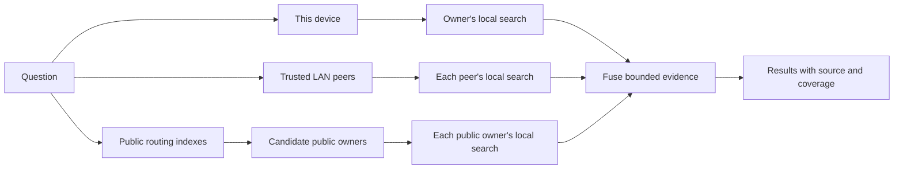

# Search across local, LAN, and public Wikis

This guide explains what happens after someone enters a question in AirWiki.
It is the conceptual map for readers who do not yet need protocol details,
operational deployment steps, or the complete threat analysis.

## The mental model

AirWiki does not upload every Wiki to a central search service. A query travels
to the devices that still own the searchable knowledge, and each owner decides
what it may return.

The public indexes are maps, not knowledge stores. They help a reader find
candidate owners. The owners search their own indexes, authorize the response,
and serve the result.

## The Library experience

The desktop opens on **Library**, with two explicit views. **On this device** is
the default inventory, ordered first by items needing attention and then by
name. **Public** is an explorable directory of bounded signed Wiki profiles and
does not require a search query. Selecting it is the action that permits a
bounded catalog request; merely opening Library performs no public networking.
The directory contacts configured indexes only. It does not contact Wiki owners
or request published content until a person opens one exact Wiki.

Local health, pending work and relevant actions stay on each Wiki rather than
being duplicated in a separate alert list. Both local and public entries use
compact, information-first rows; internal identifiers are not normal list
content.

After a brief pause in typing, AirWiki runs the latest query automatically;
pressing Enter runs it immediately. It then replaces the inventory with
Wiki-level result groups.
Each group belongs to exactly one origin, owner and Wiki, shows up to two best
matching concepts, and states the total number of matches. Filters with counts
select **All**, **This device**, **Nearby**, or **Public** without rerunning or
re-authorizing the search. Opening a concept selects that exact match; opening
the Wiki uses its best result. Returning restores the query, filter, completed
results and scroll position, while clearing the query restores the previously
selected Library view.

**Search the public network too** is explicit consent for that search. Without
it, **All** means this device plus currently authorized LAN peers. Successful
results remain visible when another peer is offline or the public branch is
unavailable, alongside actionable partial-coverage status. Queries remain out
of the URL, durable settings and logs. Editing a non-empty query clears the
public option, so the revised query stays on this device and authorized LAN
peers until the user explicitly includes the public network again.

Connected AI applications use the same source model without copying the
Library's per-query control. Their local and authorized LAN branches always
run. **Settings → AI apps → Search public knowledge** adds the public branch for
that application only and starts off. Enabling it requires native confirmation
because the application's query may reach configured indexes and selected
publishers; it does not publish or share a local Wiki.

## One search pipeline, different authorization scopes

Each source device uses the same basic retrieval pipeline:

1. Determine the collections that the caller is currently allowed to search.
2. Retrieve lexical and semantic candidates from the local operational index.
3. Fuse both rankings and remove content-stable duplicates.
4. Ask a bounded local classifier whether each passage provides evidence for
   the question.
5. Revalidate the publication revision and disclosure policy immediately before
   returning a bounded snippet with its provenance and assurance state.

`SearchPurpose` describes the retrieval use, while a separate internal
disclosure scope identifies the trusted caller. That scope and a local
application's collection list are never serialized. The desktop derives a
local-user scope, MCP derives a local-application scope from its active
capability, the LAN handler derives an authorized-peer scope from the
Noise-authenticated connection, and public serving derives a public scope from
the verified publication path.

For a folder-based Wiki, only a human-reviewed current publication may cross a
sharing boundary. Drafts, withdrawn revisions, incompatible publications, and
ambiguous state fail closed. Imported and assistant-managed Wikis follow their
own OKF and capability rules, but use the same current-publication boundary for
search disclosure.

The desktop search experience uses answerability-accepted evidence. An
external-AI search may additionally receive authorized passages that the local
classifier rejected, but AirWiki labels them as candidates rather than
evidence, and the consuming model must independently establish that they
support the requested fact. Public search is always evidence-only.

## Search on this device

Local search includes collections available to the current user and purpose,
including Wikis that have never been enabled for sharing. The query embedding,
retrieval scores, chunks, and operational index remain on the device.

Local search is also one input to a broader search. Enabling LAN or public
search does not replace it.

## Search on a private LAN

LAN access has two independent gates:

1. **Trust the device.** Discovery only indicates that a device may be nearby.
   Both devices establish persistent identities over an encrypted connection
   and a person confirms the same short authentication phrase on each one.
2. **Grant the Wiki.** The source owner separately chooses which Wikis that
   trusted device may search. A connection, device name, or network address
   never creates a grant.

When a search begins, AirWiki queries the local engine and the available
trusted peers concurrently. A remote peer derives the allowed collection scope
from its own durable trust store and per-Wiki grants; the reader does not send a
collection list that can broaden its access. The peer searches locally,
revalidates every prospective result, and returns only bounded evidence with
source provenance.

An authorized LAN hit may identify only the exact Wiki that produced it, using
a bounded name and OKF compatibility. It cannot enumerate another Wiki or
carry descriptions, counts, paths or public-profile metadata. The final
authorization check treats that presentation and its evidence as one disclosure:
revocation removes both. Clients that do not receive a name show **Shared Wiki**
instead of exposing a UUID.

New LAN grants explicitly cover the verified receiver device and its connected
AI applications. Grants created before this rule continue to serve native
AirWiki LAN search but do not answer receiver-AI searches until the owner uses
the one-time **Update existing LAN access** confirmation. Ignoring the notice
keeps the old behavior; editing or granting that Wiki again records the new
semantics. The source device's local **AI Apps** setting is irrelevant to the
receiver: the source authorizes the remote device through trust, LAN exposure,
the confirmed grant and current reviewed publication.

Because scores produced on different devices are not directly comparable, the
reader fuses their ranked lists rather than comparing raw internal scores. If a
trusted device is offline or a response fails validation, the search can still
return other evidence while explicitly reporting partial coverage.

Opening a LAN result is a separate, read-only request for that exact Wiki. The
owner revalidates the device trust, per-Wiki grant, policy, compatibility, and
publication generation before each handoff. AirWiki then reconstructs the
complete published OKF workspace from bounded transport frames: its hierarchy,
root index and log, stable concept pages, metadata, backlinks, and internal
graph. The transport never becomes a peer-wide Wiki catalog and never returns
the original source folder, source paths, chunks, embeddings, or operational
search index.

## Search on the public network

Public federation is a separate, experimental opt-in. It does not reuse LAN
pairing or LAN grants.

### 1. The owner announces a public Wiki

After the Wiki has a coherent reviewed publication, a person accepts a
disclosure warning and enables its public policy. The owner signs an expiring
manifest containing bounded profile metadata, a lexical routing sketch, the
publication fingerprint, and currently usable direct or relay routes.

The public publisher identity is separate from the LAN device identity.
Federated indexes store only signed manifests and compact withdrawal
tombstones. They have no publication authority and receive no documents,
snippets, chunks, embeddings, source paths, or complete indexes.

### 2. The reader explores or searches the catalog

Selecting **Public** sends an explicit catalog **browse** operation with the `*`
marker, a bounded result limit and the dedicated
`/airwiki/public-catalog-browse/1.0.0` capability protocol. An index returns
only current signed manifests; it does not perform an owner search or return
Wiki content. A normal search remains on the v1/v2 catalog protocols even when
its free-form text is exactly `*`, so it cannot enumerate the directory. An
older index that does not advertise the browse capability is reported as
requiring an update when no compatible index answers, or as partial when
another compatible index does answer, rather than as a successful empty directory. The reader
verifies the returned manifests, removes expired and blocked publishers, keeps
the newest sequence per publisher and Wiki, and caches only those validated
routes for a later explicit open.

A public knowledge search remains a separate per-query choice. In that path,
the reader sends a bounded lexical catalog query to configured federation
indexes. Those indexes return signed manifests for possible matching Wikis.
The reader verifies the manifests, ignores blocked or expired publishers,
groups candidates by owner, and contacts a bounded number of owners directly.

The reader uses an ephemeral identity for the application session in both
paths. Catalog exploration ends after validated profile metadata is presented;
search continues to owners because it needs evidence for the question.

The public result presentation—name, optional description, languages, concept
count and OKF compatibility—is copied only from that already validated signed
manifest. It never accepts a LAN device name, operating-system label, local path
or unsigned metadata returned by an owner.

QUIC over Noise is preferred. When a publisher is behind NAT, it can maintain
an outbound Circuit Relay reservation; a direct connection may replace that
route when the network permits it. Public federation does not require an
inbound Windows Public-profile firewall rule.

The index has now finished its job. Each selected owner runs the question
through its local search pipeline and revalidates the exact public policy,
reviewed revision, manifest sequence, and publication fingerprint under a
disclosure lease. A stale catalog entry therefore cannot force an owner to
return stale or private content.

### 3. The reader merges or opens the result

The reader fuses the independently ranked public responses and merges them with
the concurrent local and LAN branches. The UI preserves the source lane and
reports whether accepted public responses arrived directly, through a relay,
or not at all.

Opening a public result requests the complete published OKF workspace for that
exact Wiki directly from its owner, using generation-bound frames and
fingerprint-bound page reads. It remains read-only. A public reader can retain
evidence and any published Wiki content it has already received, so public
exposure must be treated as disclosure rather than temporary viewing.

## Permissions at a glance

| Search path | How the source is found | What authorizes disclosure | Where retrieval runs |
| --- | --- | --- | --- |
| Local | Local SQLite state | Current local publication and purpose | This device |
| LAN | Local discovery or a validated manual route | Authenticated pairing, per-Wiki grant, collection policy, and current publication | Each trusted source device |
| Public | Signed, expiring manifests from replaceable routing indexes | Explicit public opt-in and the owner's current reviewed publication | Each public owner's device |
| Connected AI: local | Local MCP gateway | Active application capability, per-Wiki application grant and local external-AI gate | This device |
| Connected AI: LAN | The same local-plus-LAN coordinator | The source's authenticated pairing, confirmed receiver-AI grant, LAN exposure and current publication | Each trusted source device |
| Connected AI: public | The application's optional public branch | Per-application query-egress consent plus each owner's signed current public policy | Each public owner's device |

The permissions are intentionally independent. Pairing a device does not grant
a Wiki. Granting LAN access does not make the Wiki public. Connecting an AI
client does not enable LAN sharing or Internet publication. It may search what
remote owners already exposed to its device; public query egress remains off
until enabled for that exact app. There are no reader-side permissions per
remote Wiki or result. A local model may propose metadata but cannot publish or
change any of these permissions.

## Failure, revocation, and coverage

- Local and LAN search run concurrently. When public search is enabled, its
  catalog-and-owner branch runs concurrently with them.
- A failed branch does not erase valid results from another branch. AirWiki
  marks the result as partial or offline instead of claiming complete coverage.
- LAN revocation narrows runtime access, removes durable grants, retires
  in-flight searches, and closes active connections. Rediscovery cannot restore
  access.
- MCP reauthorizes the application after federation. Revoking it discards the
  complete response; changing local grants removes newly unauthorized local
  hits. Turning public search off during an in-flight public request discards
  that response and requires a retry.
- Disabling public exposure changes the owner's durable policy first and stops
  new responses immediately. The owner then sends a signed tombstone to the
  indexes. A delayed tombstone may leave stale routing metadata visible until
  expiry, but the owner still refuses disclosure.
- Public availability depends on the owner being online. AirWiki does not
  replicate public Wiki content for offline serving.

During mixed-version rollout, a new reader never bypasses an older publisher's
policy. An older publisher can omit LAN evidence requested by a connected AI
application until that publisher is upgraded or its earlier external-AI policy
already permits the result. This is a temporary coverage gap, not an automatic
permission expansion.

## Deliberate limits

Public federation is experimental and currently has no supported always-on
public relay service. It is not a hosted web Wiki, cloud sync system, account
service, DHT, gossip network, remote-editing channel, or offline content mirror.
Replaceable indexes can omit or delay publishers and degrade availability, but
they cannot sign an owner's manifest or authorize its content.

For normative decisions and operational validation, continue with:

- [Architecture](architecture.md)
- [ADR 0005: LAN identity, pairing, and authorization](adr/0005-lan-identity-pairing-and-authorization.md)
- [ADR 0007: evidence and authorized external-AI candidates](adr/0007-separate-evidence-from-authorized-candidates.md)
- [ADR 0008: public federation](adr/0008-public-federation.md)
- [ADR 0013: connected applications search accessible federated knowledge](adr/0013-connected-app-federated-search.md)
- [Threat model](threat-model.md)
- [Private two-node acceptance runbook](two-node-runbook.md)
- [Internet federation acceptance runbook](internet-federation-runbook.md)
